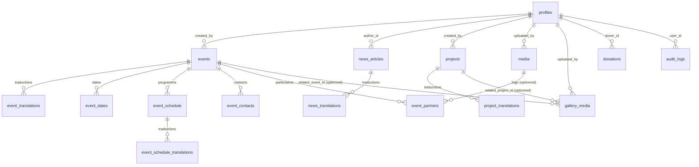

# Schéma Supabase — FMT e.V.

Documentation de référence pour la base de données du site. Ce document explique **le rôle de chaque table**, **ses colonnes importantes**, et **ses relations** avec le reste du schéma.

Migrations correspondantes : `0001_init_schema.sql` → `0005_gallery_media_schema.sql`.

---

## 1. Conventions transversales (à connaître avant de lire le détail des tables)

Ces règles s'appliquent à tout le schéma, elles ne sont pas répétées table par table.

### Rôles (3, définis dans `profiles.role`)
| Rôle | Peut |
|---|---|
| `SUPER_ADMIN` | Tout : créer, modifier, **supprimer**, gérer les utilisateurs et leurs rôles |
| `EDITOR` | Créer et modifier du contenu (events, news, projects), uploader des médias — **ne peut pas supprimer**, ni gérer les comptes |
| `OBSERVATOR` | Lecture seule sur le contenu et sur les dons |

Ces règles sont appliquées par **Row Level Security (RLS)**, pas par le code applicatif — même une requête mal écrite ne peut pas contourner ces droits.

### Le pattern "table + `_translations`"
Chaque contenu multilingue (`events`, `news_articles`, `projects`, `gallery_albums` s'il est réintroduit un jour) suit le même découpage :
- La **table principale** contient tout ce qui est indépendant de la langue (dates, statut, relations).
- Une table `xxx_translations` contient une ligne par langue (`locale` = `fr` / `en` / `de`) avec les champs textuels (titre, description...).

Avantage : ajouter une langue = ajouter des lignes, jamais des colonnes.

### Le pattern `is_published`
`events`, `news_articles`, `projects` et `gallery_media` ont tous un booléen `is_published`. C'est **la seule chose qui contrôle la visibilité publique** (RLS : `select` autorisé aux visiteurs anonymes uniquement si `is_published = true`). Un `EDITOR` peut donc préparer du contenu à l'avance sans qu'il apparaisse sur le site.

### Le pattern média "portable"
Aucune URL d'image/vidéo n'est jamais stockée telle quelle. On stocke `provider` (`cloudinary` aujourd'hui) + `storage_ref` (l'identifiant chez ce prestataire). L'URL réelle est reconstruite à l'affichage par `lib/utils/media.ts`. Objectif : changer de prestataire un jour ne touche qu'un seul fichier de code, jamais le schéma ni les composants.

### `updated_at` automatique
Les tables avec un cycle de vie éditorial (`profiles`, `events`, `news_articles`, `projects`) ont un trigger qui met à jour `updated_at` à chaque `UPDATE` — inutile de le gérer depuis le code.

---

## 2. Table `profiles` — utilisateurs du dashboard

Étend `auth.users` (gérée par Supabase Auth) avec les informations propres à l'app : rôle, langue préférée, statut actif.

| Colonne | Rôle |
|---|---|
| `id` | Identique à `auth.users.id` (relation 1-to-1) |
| `role` | `SUPER_ADMIN` / `EDITOR` / `OBSERVATOR` |
| `is_active` | Permet de désactiver un compte sans le supprimer |

**Créée automatiquement** dès qu'un compte s'inscrit via Supabase Auth (trigger `handle_new_user`), avec le rôle `OBSERVATOR` par défaut — un `SUPER_ADMIN` doit ensuite promouvoir manuellement.

**Référencée par** : `events.created_by`, `news_articles.author_id`, `projects.created_by`, `media.uploaded_by`, `gallery_media.uploaded_by`, `donations.donor_id`, `audit_logs.user_id`. C'est la table centrale de traçabilité : on sait toujours *qui* a créé ou modifié quoi.

---

## 3. Cluster "Événements"

### `events`
Le cœur d'un événement : slug, statut (`is_online`, `is_free`, `is_published`), lien d'inscription. **Aucun texte** ici — tout le contenu lisible est dans `event_translations`.

### `event_translations`
Une ligne par langue : `title`, `theme`, `description`, `location_name`, `location_address`. → `events` via `event_id`.

### `event_dates`
Une ou plusieurs plages horaires (`date`, `start_time`, `end_time`) — pense aux événements sur plusieurs jours. → `events` via `event_id`.

### `event_schedule` + `event_schedule_translations`
Le programme détaillé (ex : "Panel 1", "Ateliers"). Même découpage que plus haut : `event_schedule` porte l'ordre (`order`), `event_schedule_translations` porte le texte par langue (`part_label`, `time_range`, `title`, `description`).

### `event_contacts`
Emails/téléphones de contact liés à l'événement. Pas de traduction (une adresse email ne se traduit pas).

### `event_partners`
Organisations partenaires d'un événement (nom + logo optionnel via `logo_media_id → media.id`, seule relation *réelle* — pas polymorphe — vers `media`).

**Relations** : toutes les tables `event_*` pointent vers `events.id` avec `on delete cascade` — supprimer un événement supprime automatiquement tout son contenu associé (traductions, dates, programme, contacts, partenaires).

---

## 4. Cluster "Actualités"

### `news_articles`
Slug, statut de publication, date de publication, auteur (`author_id → profiles.id`).

### `news_translations`
Titre, extrait (`excerpt`), corps (`body`), une ligne par langue. → `news_articles` via `article_id`.

---

## 5. Cluster "Projets"

### `projects`
Slug, statut d'avancement (`active` / `completed` / `planned`), dates, nombre de bénéficiaires.

### `project_translations`
Titre, description, objectifs, une ligne par langue. → `projects` via `project_id`.

---

## 6. `media` — médias attachés à un contenu existant

Table **polymorphe** : une seule table pour tous les visuels attachés à un event, un article, un projet ou un profil, distingués par `owner_type` (`'event' | 'news' | 'project' | 'profile'`) + `owner_id`.

| Colonne | Rôle |
|---|---|
| `provider`, `storage_ref` | Référence portable vers le prestataire de stockage |
| `is_cover` | Marque le visuel principal (affiché en tête de card) |
| `order` | Ordre d'affichage dans une galerie secondaire |
| `width`, `height`, `duration_seconds` | Dimensions réelles — permettent un affichage sans déformation ni décalage de mise en page |

⚠️ **Limite connue** : `owner_id` n'est **pas** une vraie clé étrangère SQL (impossible avec un `owner_type` variable). Supprimer un event/article/projet ne supprime donc pas automatiquement ses lignes `media` associées — elles deviennent orphelines. À corriger plus tard par un trigger applicatif ou une tâche de nettoyage planifiée si le volume le justifie.

**Relation réelle (non polymorphe)** : `event_partners.logo_media_id → media.id`, résolue simplement par une jointure classique.

---

## 7. `gallery_media` — galerie "sur le terrain"

Table **volontairement séparée** de `media` : contrairement aux visuels ci-dessus, ces photos/vidéos ne sont attachées à rien — elles forment un flux chronologique autonome (tri par `created_at`, du plus récent au plus ancien), alimenté en continu par le dashboard.

| Colonne | Rôle |
|---|---|
| `related_event_id`, `related_project_id` | Nullables — permettront un filtrage optionnel plus tard, sans contrainte aujourd'hui |
| `created_at` | Sert directement de critère de tri à l'affichage (pas de colonne `order` nécessaire) |

Pas de table `_translations` associée : `alt`/`caption` restent en une seule langue pour l'instant (contenu descriptif, pas éditorial).

---

## 8. `donations`

Historique des dons : montant (`amount_cents`, en centimes pour éviter les erreurs d'arrondi), devise, statut de paiement, donateur optionnel (`donor_id → profiles.id`, nullable si don anonyme).

**Confidentialité** : aucune policy de lecture publique n'existe sur cette table — ni `EDITOR` ni les visiteurs anonymes n'y ont accès, seuls `SUPER_ADMIN` (gestion complète) et `OBSERVATOR` (lecture seule) peuvent la consulter.

---

## 9. `audit_logs`

Journal d'actions sensibles (qui a fait quoi, quand). `resource_type` + `resource_id` identifient la ressource concernée (même limite polymorphe que `media` : pas de FK réelle). Lecture réservée à `SUPER_ADMIN`.

---

## 10. Schéma relationnel

*Note : `media.owner_id` (relation vers events/news_articles/projects/profiles) n'apparaît pas ici car ce n'est pas une clé étrangère réelle — voir la limite décrite section 6.*

---

## 11. Où voir les policies RLS complètes ?

Le détail exact de chaque règle d'accès (qui peut `select`/`insert`/`update`/`delete` sur quelle table) est dans les fichiers de migration eux-mêmes (`0001_init_schema.sql`, section 13, et `0005_gallery_media_schema.sql`) — ce document donne la vue d'ensemble, les migrations font foi pour le détail exact.